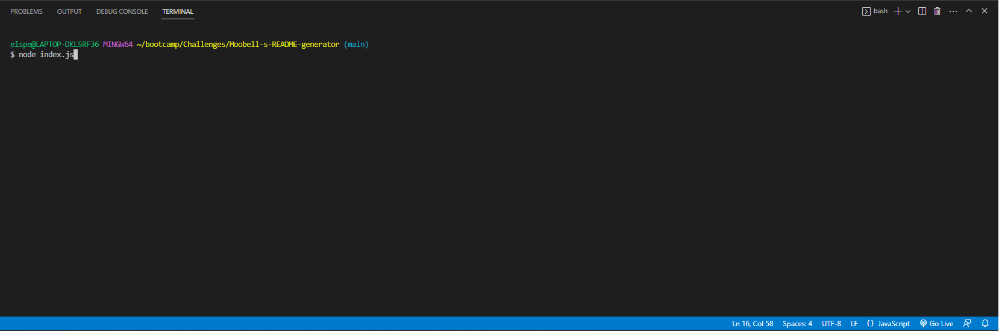
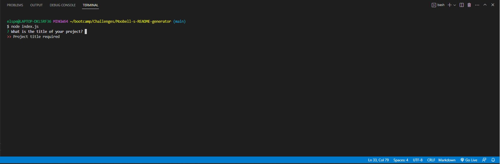
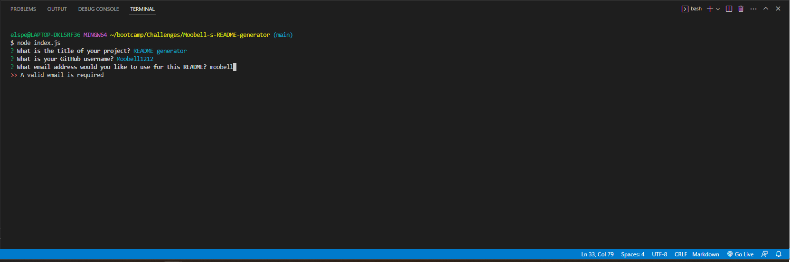
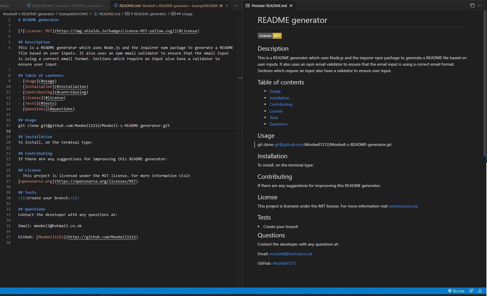
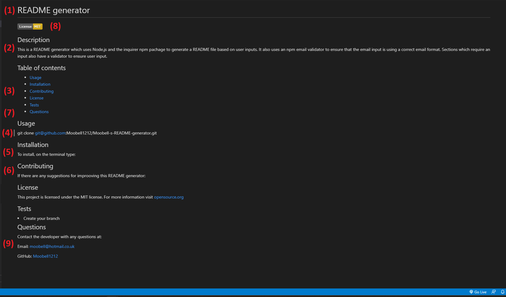

# README generator


</br>

<div align="center" id="top">

[](https://github.com/Moobell1212/README-generator/graphs/contributors)
[](https://github.com/Moobell1212/README-generator/forks)
[](https://github.com/Moobell1212/README-generator/stargazers)
[](https://github.com/Moobell1212/README-generator/issues)

</br> 
  
[](https://skillicons.dev)

</div>

</br>

## Description
This is a README generator which uses Node.js and the inquirer npm pachage to generate a README file based on user inputs. It also uses an npm email validator to ensure that the email input is using a correct email format. Sections which require an input also have a validator to ensure user input.

## Demo


https://user-images.githubusercontent.com/117773958/220438358-58773dbb-16e9-4b76-a83f-d83d1dcfa5f2.mp4

Link to video demo: https://drive.google.com/file/d/1_OXqpSBsoghVm4w61YMDmU8P9RrcIQQr/view?usp=share_link

## Table of contents
- [Usage](#usage)
- [Installation](#installation)
- [Contributing](#contributing)
- [License](#license)
- [Tests](#tests)
- [Questions](#questions)

## Usage
The demo above shows the program usage. Detailed steps are below.
<ol>
<li>The terminal must be opened to the correct directory, shown below using Visual Studio Code on a Windows system.</li>
<li>The index.js file must be run by typing 'node index.js'</li>
</br>

</br>
<li>Questions will run in the terminal which must be answered.</li>
<ul>
<li>There is a validator to the title of the project user input as shown below.</li>
</br>

</br>
<li>There is an validator to ensure proper email format as shown below.</li>
</br>

</br>
</ul>
<li>Once the questions are answered, the README file will be added to the 'ExampleREADME' file.</li>
</br>

</br>
<li>The README will then print with the below information based off the user inputs</li>
<ul>
<li>The title of the project (1)</li>
<li>The descption of the project (2)</li>
<li>A table of contents with links to the corresponding section of the README (3)</li>
<li>Usage of the project (4)</li>
<li>Instruction for installation (5)</li>
<li>How someone can contribute to the project (6)</li>
<li>The license used in the project (7) and the badge for the license (8). If there is no license used, the license section is removed and there is no license badge displayed</li>

<li>How the developer can be contacted with links via email (9) and a link to their GitHub repository (10)</li>
</ul>
</br>

</br>
</ol>

<p align="right">(<a href="#top">back to top</a>)</p>

## Installation
To install, on the terminal type:
```
git clone git@github.com:Moobell1212/Moobell-s-README-generator.git
```

Install the NPM packages writing the below in the terminal:
```
npm install
```
<p align="right">(<a href="#top">back to top</a>)</p>

## Contributing
If there are any suggestions for improoving this README generator:
<ol>
<li>Fork the project</li>
<li>Create your branch</li>
<li>Commit your changes</li>
<li>Push your code to the branch</li>
<li>Create a pull request in the repository</li>
</ol>

Any contributions you make are greatly appreciated.

<p align="right">(<a href="#top">back to top</a>)</p>

## License
This project is licensed under the MIT license. For more information visit [https://opensource.org/licenses/MIT](https://opensource.org/licenses/MIT).

<p align="right">(<a href="#top">back to top</a>)</p>

## Tests
None

<p align="right">(<a href="#top">back to top</a>)</p>

## Questions
Contact the developer with any questions at the GitHub repository: [Moobell1212](https://github.com/Moobell1212).

<p align="right">(<a href="#top">back to top</a>)</p>
